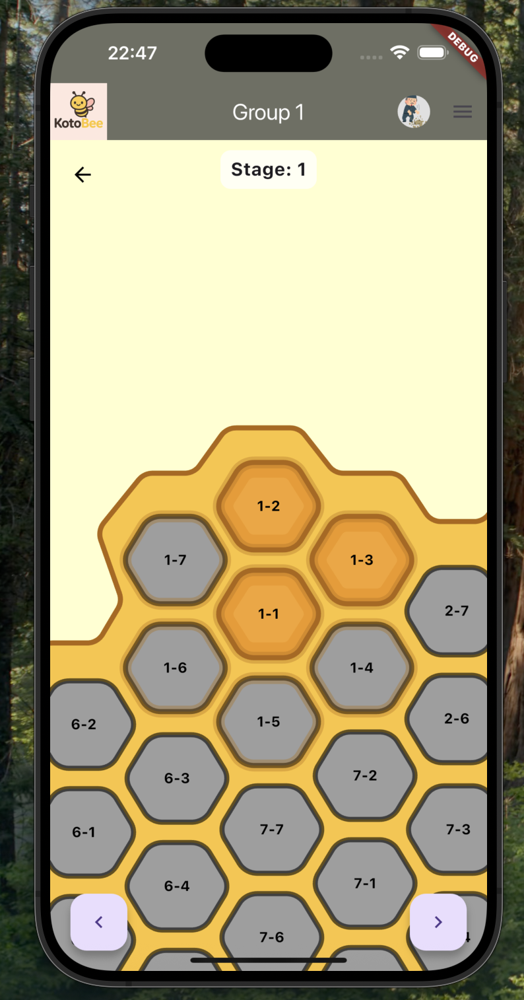
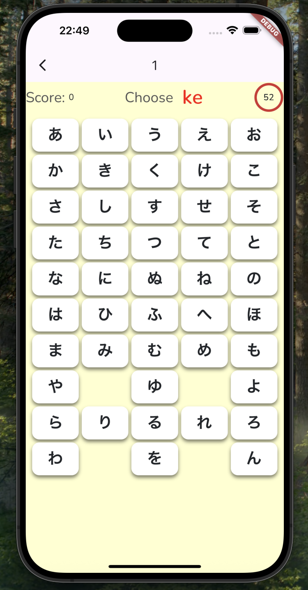
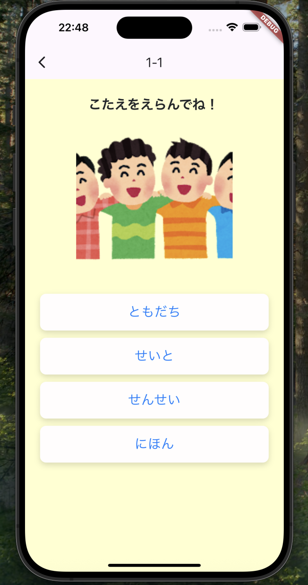
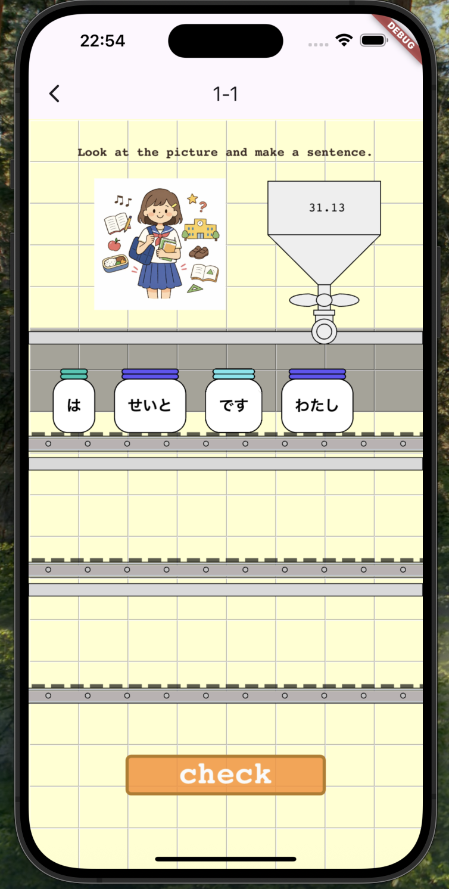
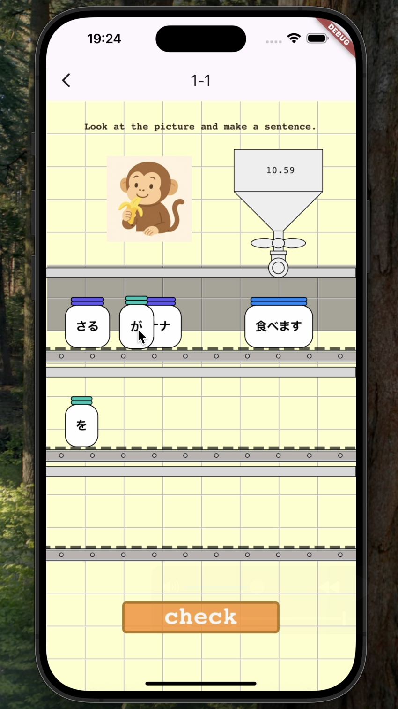
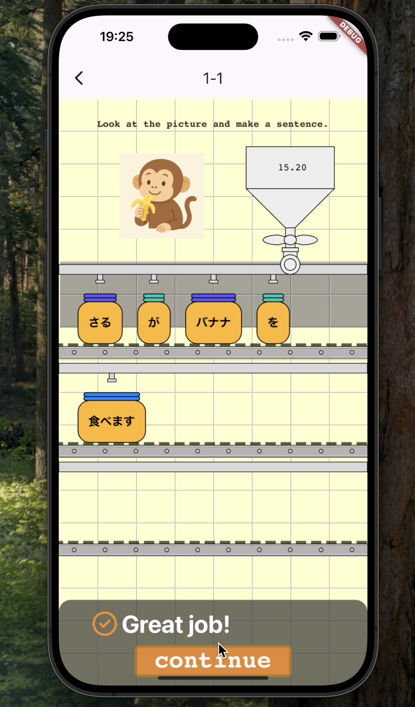
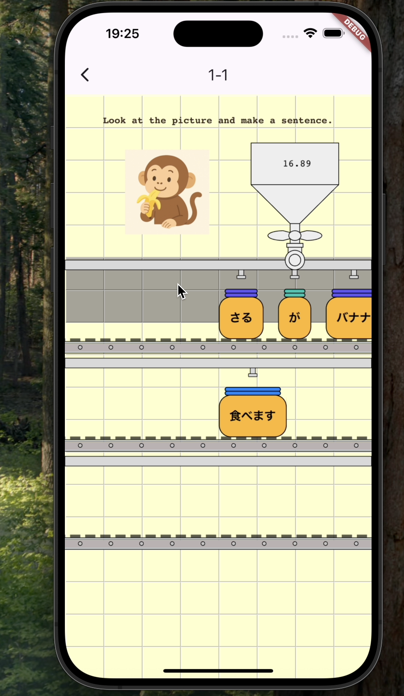
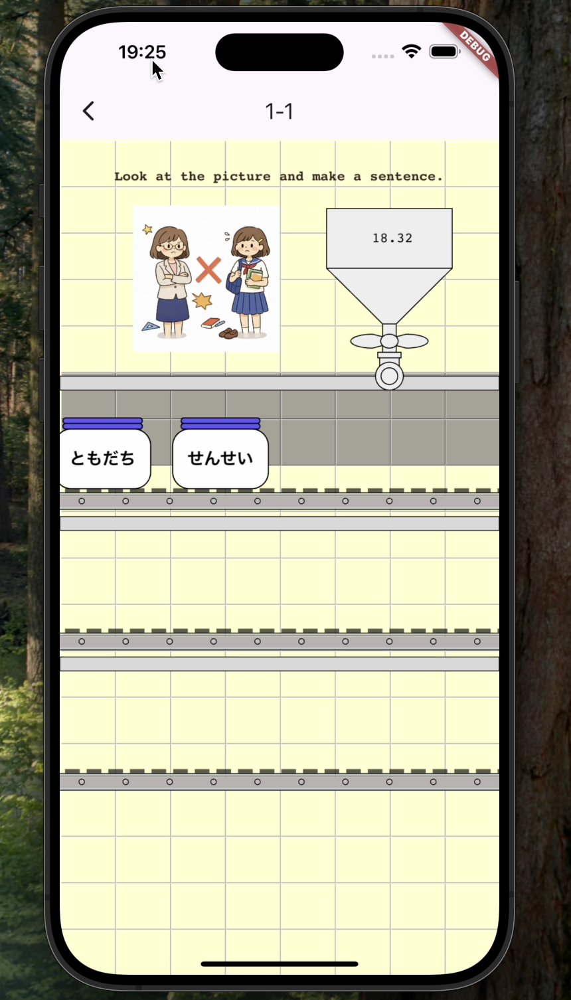
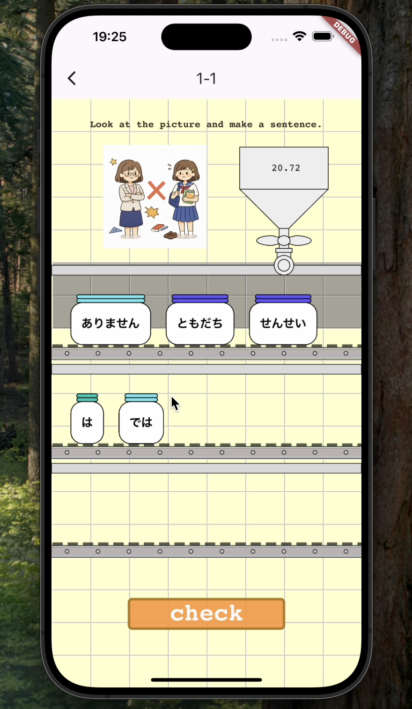
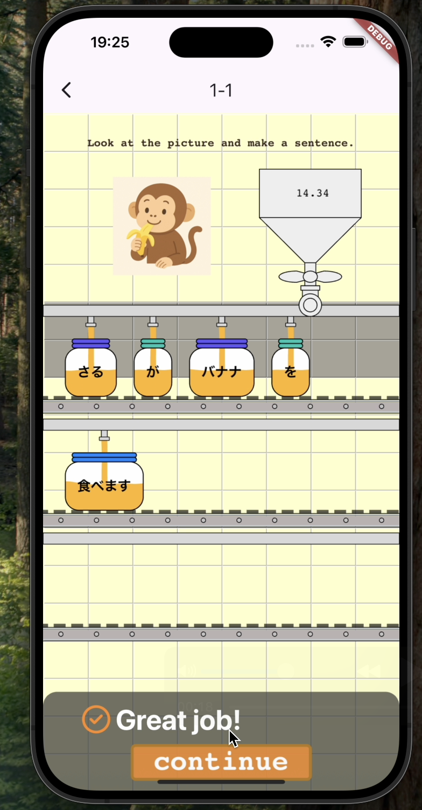

## 📖 概要

**アプリ名**：Kotobee  
**開発人数**：3人  
**開発期間**：3ヶ月  
**主な担当機能**：Grammarゲーム、ステージ選択画面、管理者ダッシュボード  

**アプリ説明**： 
Kotobeeは、日本語学習者とグループ管理者を対象とした日本語学習アプリです。 
学習者は Kana・Vocabulary・Grammar の3種類のゲームを通して日本語を学習できます。 
管理者はグループ内の学習者の進捗状況をダッシュボードで確認し、学習をサポートできます。 
学習者は管理者へ参加申請を行い、承認されることでグループに参加できます。 
チーム開発では、Laravelを用いたWebアプリケーションとして開発しました。 
その後、学生の利便性向上を目的として、Flutterを用いたモバイルアプリとして一部機能を実装しました。

## 📸 スクリーンショット

### ステージ選択画面

  

### 各ゲームのプレイ画面

<table align="center">
  <tr>
    <td align="center">
       
      <b>Kana Game</b>
    </td>
    <td align="center">
       
      <b>Vocabulary Game</b>
    </td>
    <td align="center">
       
      <b>Grammar Game</b>
    </td>
  </tr>
</table>

### グループ管理者ダッシュボード

  

## ✨ 主な機能
- 日本語学習のための3つのゲーム
  - Kana
  - Vocabulary
  - Grammar
- 教師が生徒の学習進捗を確認できるWebダッシュボード
- ユーザー認証（ログイン機能）
- 決済システム

## 🚀 主な改善点
- より強固な認証システム（Googleログイン、メール認証ログイン）
- モバイル・Web両方のUI/UX改善
- 生徒と教師間のチャット機能
- バグ修正および安定性向上

## 🛠 使用技術

### モバイルアプリケーション
- Flutter
- Dart

### バックエンド / Webアプリケーション
- Laravel
- PHP
- MySQL

### 開発環境・ツール
- MAMP (local development environment)
- Git / GitHub

## 📂 プロジェクト構成
- `mobile_flutter/` : 学習者向けFlutterモバイルアプリ
- `web_laravel/`   : LaravelバックエンドAPIおよび教師用Webダッシュボード

## 📸 イメージ

### 学習者画面(webフロントエンド)
- [ログイン画面1](assets/student_images/login_image_1.png)
- [ログイン画面2](assets/student_images/login_image_2.png)
- [ゲーム選択画面](assets/student_images/game_selection_image.png)
- [ゲーム開始モーダル](assets/student_images/kana_game_start.png)
- [ゲーム終了モーダル](assets/student_images/kana_game_finish.png)
- [Kanaゲーム選択画面](assets/student_images/kana_game_selection.png)
- [Kanaゲームプレイ画面](assets/student_images/kana_game_play.png)
- [VocabとGrammarゲームの選択画面](assets/student_images/vocab_grammar_selection.png)
- [Vocabゲームプレイ画面](assets/student_images/vocab_game_play.png)
- [Grammarゲームプレイ画面](assets/student_images/grammar_game_play.png)
- [グループ検索画面](assets/student_images/group_search.png)
- [グループ申請画面](assets/student_images/group_application.png)
- [プロフィール画面1](assets/student_images/profile_1.png)
- [プロフィール画面2](assets/student_images/profile_2.png)
- [単語リスト](assets/student_images/word_list.png)
- [文章リスト](assets/student_images/sentence_list.png)
- [プロフィール編集画面1](assets/student_images/profile_edit_1.png)
- [プロフィール編集画面2](assets/student_images/profile_edit_2.png)

### 学習者画面(flutter)
- [ログイン画面](assets/student_images_flutter/login.png)
- [ゲーム選択画面](assets/student_images_flutter/game_selection.png)
- [Kanaゲームプレイ画面](assets/student_images_flutter/kana_game_play.png)
- [Vocabゲームプレイ画面](assets/student_images_flutter/vocab_game_play.png)
- [Grammarゲームプレイ画面](assets/student_images_flutter/grammar_game_play.png)
- [VocabとGrammarゲームの選択画面](assets/student_images_flutter/vocab_grammar_selection.png)
- [プロフィール画面](assets/student_images_flutter/profile.png)

### グループ管理者画面
- [グループオプション選択画面](assets/administrator_images/group_sub.png)
- [決済画面](assets/administrator_images/group_purchase.png)
- [決済終了画面](assets/administrator_images/purchase_finish.png)
- [グループダッシュボード画面1](assets/administrator_images/dashboard_1.png)
- [グループダッシュボード画面2](assets/administrator_images/dashboard_2.png)
- [グループダッシュボード画面3](assets/administrator_images/dashboard_3.png)
- [生徒の申請の承認と否認の選択画面](assets/administrator_images/group_student_list.png)
- [グループ一覧画面](assets/administrator_images/group_list.png)
- [グループ編集画面](assets/administrator_images/group_edit.png)
- [グループから生徒を削除する画面](assets/administrator_images/student_delete.png)
- [グループ作成画面](assets/administrator_images/group_create.png)
- [問題作成画面](assets/administrator_images/question_create.png)
- [グループ削除画面](assets/administrator_images/group_delete.png)

## 💡 工夫した箇所

### 1. ステージ選択画面

  

### 1.1 コンセプト
Kotobeeの名称に合わせて蜂を連想させるデザインにしたいと考え、蜂の巣の断面構造をモチーフとしたステージ選択画面を設計しました。

### 1.2 工夫した点
Figmaで六角形や背景などの各パーツを、解像度を保つためにSVG形式のベクター画像として出力しました。 
上記の画像の7-1の六角形を中心とする円構造として捉え、7-1から1-1の半径をxとyの距離から三平方の定理で求めました。 
その後、1-1を回転の始点とするために三角関数を使用して角度を求め、6-1まで右回転としてfor文で動かして描写しました。 
また、UI面では左右ボタンおよびスワイプ操作によって各ステージ(1-1や1-2)を中心とした画面に切り替えられるように設計し、直感的な操作を実現しました。

### 2. Grammarゲーム 

### 2.1 コンセプト
ハチミツを瓶に注ぐ工場をイメージしたGrammarゲームを作成しました。 
ユーザーは画面に表示された画像に適した文章を瓶を動かして作成します。 
ゲームの制作には、JavaScriptのゲームエンジンであるPhaser3を使用しました。

### 2.2 工夫した点(スワイプ機能)

  

直感的にプレイできるよう、瓶をスワイプ操作で動かして文章を作る設計にしました。

### 2.3 工夫した点(ベルトコンベアアニメーション)

  
  
  
  

設問の切り替え時には、ベルトコンベアのように横方向へスライドするアニメーションを実装しました。 
動きのあるアニメーションを加えることにより、ユーザーが視覚的に楽しめるようにしました。

### 2.4 工夫した点(波のアニメーション)

  

正解時に瓶にハチミツを注ぐアニメーションでは、滑らかな波を表現するために、5つの異なるsin波を合成して波形を生成しました。 
振幅、周期、位相を調整することで、より自然な波を描写しました。

## 🗞️ おわりに
要件定義やUI・データベース設計といった上流工程から、実装を中心とした下流工程まで幅広く経験しました。 
設計不足によって実装で課題に直面することもありましたが、チームメンバーと相談しながら解決することで、設計と協働の重要性を学びました。 
最後までお読みいただき、ありがとうございました。